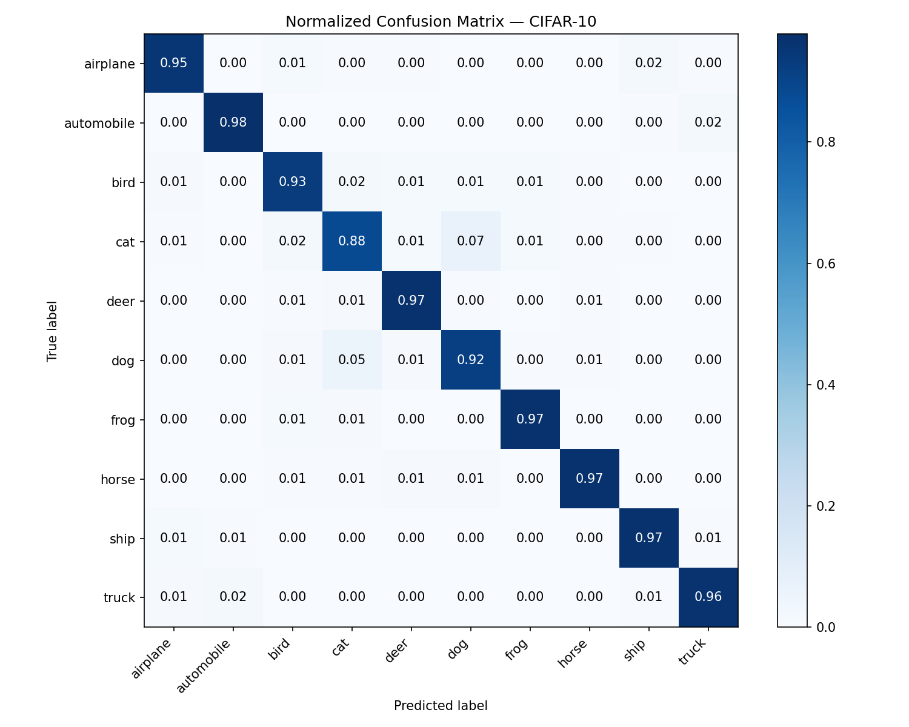

# CIFAR-10 CNN Classifier

A clean, production-style image classification project built with PyTorch.
Trains a custom CNN on the CIFAR-10 dataset from scratch, achieving ~83% accuracy on the validation set.

---

## Results



| Metric | Value |
|--------|-------|
| Validation Accuracy | 95% |
| Best class | Automobile (F1: 0.98) |
| Hardest class | Cat (F1: 0.89) |

---

## Project Structure

```
cifar10-cnn-classifier/
├── data/                  # CIFAR-10 dataset (auto-downloaded, git-ignored)
├── checkpoints/           # Model checkpoints (git-ignored)
├── logs/                  # TensorBoard logs (git-ignored)
├── results/               # Evaluation artifacts (git-ignored)
├── docs/
│   └── images/            # Figures showcased in this README
├── src/
│   ├── dataset.py         # Data loading & transforms
│   ├── model.py           # CNN architecture
│   ├── train.py           # Training loop
│   ├── evaluate.py        # Evaluation & metrics
│   └── utils.py           # Seed, device, logger
├── configs/
│   └── config.yaml        # All hyperparameters
├── main.py                # Entry point
└── requirements.txt
```

---

## Setup

**1. Clone the repository**
```bash
git clone https://github.com/YOUR_USERNAME/cifar10-cnn-classifier.git
cd cifar10-cnn-classifier
```

**2. Create and activate a virtual environment**
```bash
python -m venv .venv
.venv\Scripts\activate      # Windows
source .venv/bin/activate   # macOS/Linux
```

**3. Install dependencies**
```bash
pip install torch torchvision torchaudio --index-url https://download.pytorch.org/whl/cu128
pip install -r requirements.txt
```

---

## Usage

**Train and evaluate**
```bash
python main.py
```

CIFAR-10 (~170MB) is downloaded automatically on the first run.

**Monitor training with TensorBoard**
```bash
tensorboard --logdir logs/
```

Then open [http://localhost:6006](http://localhost:6006).

---

## Model Architecture

ResNet18 adapted for CIFAR-10 with two key modifications from the original ImageNet version:
- Initial conv is 3×3 stride 1 (instead of 7×7 stride 2)
- No initial maxpool layer

The network consists of an initial convolution followed by 4 stages of 2 BasicBlocks each
(64 → 128 → 256 → 512 channels), ending with global average pooling and a linear classifier.
The skip connections allow gradients to flow through the entire 18-layer network without
vanishing, which is the key innovation that enables training such deep architectures.

The codebase supports both `SimpleCNN` (baseline) and `ResNet18` — switchable via `config.yaml`.

---

## Configuration

All hyperparameters are centralized in `configs/config.yaml`. No need to touch the source code to run experiments.

Key parameters:

| Parameter | Value |
|-----------|-------|
| Architecture | ResNet18 (~11M params) |
| Epochs | 100 |
| Batch size | 128 |
| Learning rate | 0.001 |
| Optimizer | AdamW |
| Scheduler | LinearLR warmup (5 epochs) + CosineAnnealingLR |
| Weight decay | 0.0005 |

---

## Dataset

[CIFAR-10](https://www.cs.toronto.edu/~kriz/cifar.html) — 60,000 images (32×32, RGB) across 10 classes:
airplane, automobile, bird, cat, deer, dog, frog, horse, ship, truck.
Split: 50,000 train / 10,000 validation.

---

## License

MIT